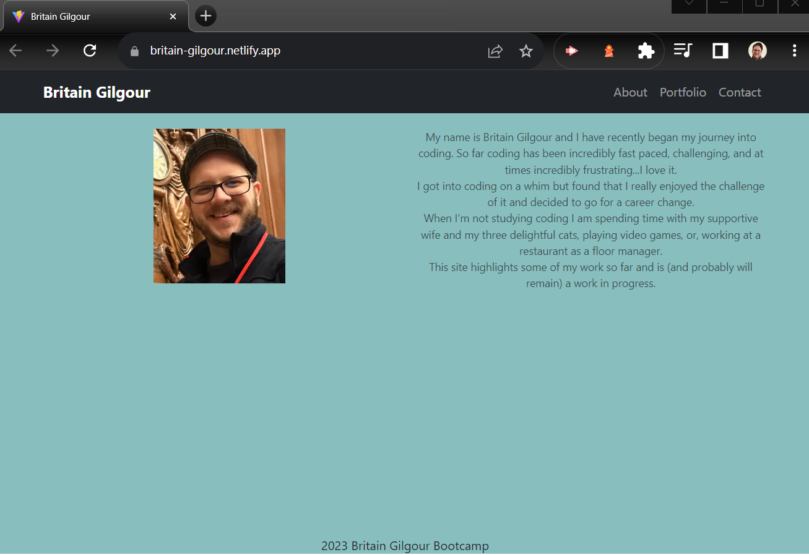

  # React Portfolio 
  ## Badges
  
  ## Description:
  I needed a website to showcase what I have learned throughout bootcamp and to be a place to show prospective employers my talents.

  ## Screenshot

 
  ### Table of Contents:
  
  * [Installation Instructions](#installation)
  * [Usage](#usage)
  * [Credits](#credits)
  * [License](#license)
  * [Contact](#contact)
  
  
  ## Credits:

  [An article really helped me figure out the CONTACT page for my site](https://dev.to/ebereplenty/contact-form-with-emailjs-react-581c)
  ## Ways to Contribute:
 
  ## License:
  * The License for this project is: MIT
  * Please go to [https://choosealicense.com/](https://choosealicense.com/) for more information regarding
  licenses.
  ## Contact:
  * GitHub: britaing
  * Email:  britaing@gmail.com
